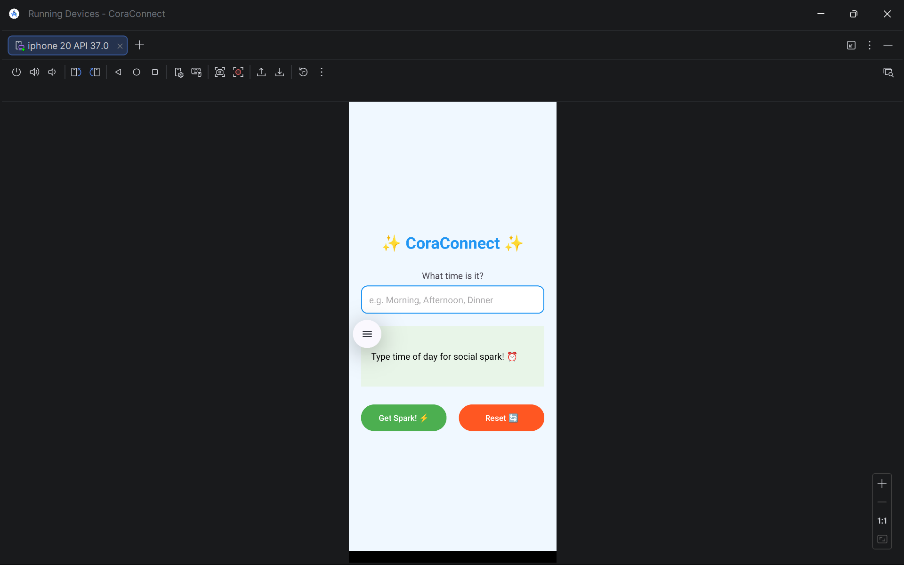
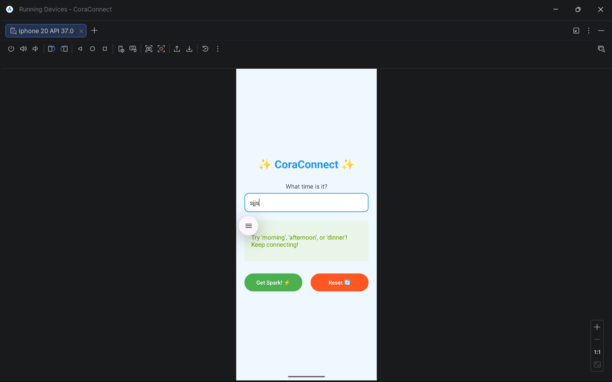

# ✨ CoraConnect ✨

Android app built in Kotlin to help my friend Cora stay connected with quick "social sparks" based on time of day.

## 🎥 Demo Video
[](https://youtu.be/YOUR_YOUTUBE_LINK)

## 📱 Screenshots






## ✨ Features
- Real-time suggestions while typing (TextWatcher)
- 6 time-based social sparks (when statements)
- Visual feedback (green success, red errors)
- Professional logging (filter Logcat: `CoraConnect`)
- Submit + Reset buttons
- Error handling with motivational messages

## 🕒 Social Sparks
| Time Input | Suggestion |
|------------|------------|
| morning | Good morning text to family |
| afternoon | Share funny meme with friend |
| dinner | 5-minute catch-up call |
| night | Comment on friend's post |
| snack | Thinking of you message |
| Invalid | Try again message |

## 🛠️ Tech Stack
- **Language**: Kotlin
- **IDE**: Android Studio
- **Min SDK**: 24 (Android 7.0+)
- **Key Features**: TextWatcher, when expressions, ContextCompat

## 🚀 Quick Start
```bash
# 1. Clone repo
git clone https://github.com/YOUR_USERNAME/coraconnect.git
cd coraconnect

# 2. Open in Android Studio
# 3. Run on emulator/device (API 30+ recommended)
```

## 🧪 Testing
✅ **Manual Tests Passed**:
- All 6 valid time inputs
- Invalid input error handling
- Submit + Reset functionality
- Logcat logging (tag: `CoraConnect`)

✅ **Automated** (GitHub Actions):
- Gradle build
- APK generation

## 📊 Logcat Example